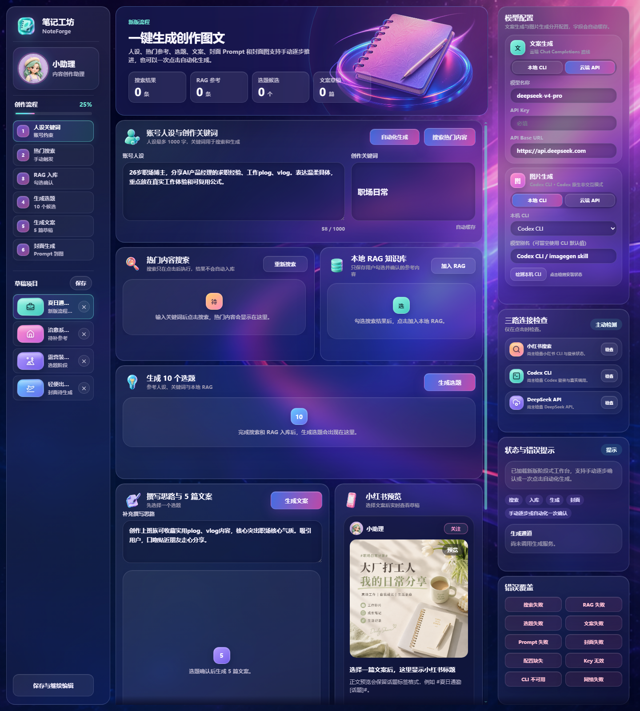

# 笔记工坊 / NoteForge

`笔记工坊 / NoteForge` 是一个 React + Vite 桌面端 Web App，用于辅助生成小红书内容图文。完整工作流：人设和关键词输入、热门内容搜索、加入本地 RAG、生成选题、生成文案、生成封面 Prompt、生成封面图。

项目保持 3 列内容创作工作台形态，并保留 Pastel 3D Claymorphism 视觉方向。当前链路支持本机 `xhs` CLI 热门搜索、本地 Codex/Kimi/Claude/自定义规范 CLI 文本生成、Codex 本地图片生成，以及云端 OpenAI-compatible API 生成；RAG 入库支持用户手动勾选确认，也支持用户点击“自动化生成”后由文案模型选择参考内容并入库。

## 预览



## 本地运行

Windows 首次使用小红书搜索时，先双击 `Setup-Xhs.bat`。它会把 `xiaohongshu-cli` 安装到项目内的 `.tools/xhs` 隔离环境；安装完成后双击 `XhsLogin.bat`，按提示在 Chrome/Edge 小红书网页完成登录、关闭浏览器，再让脚本导入浏览器 Cookie。登录与搜索都不会在后台自动触发。

本地 Codex 图片生成首次使用时，双击 `CodexLogin.bat`。脚本会自动发现 Codex 桌面应用自带的 `codex.exe`，运行 `codex login` 并在浏览器中使用 ChatGPT 账号登录；登录完成后会运行 `codex login status` 验证。`NoteForge.bat` 同样会自动把该动态路径注入 `CODEX_CLI_PATH`。

服务端也会自行发现项目内的 xhs、Codex 桌面 CLI 和当前 Windows 用户的 Codex 登录目录，因此普通 Vite 开发启动不再把已安装的 CLI 误报为缺失。若云端 API 提示当前 Node 服务没有外网权限，请关闭由 Codex 或其他受限开发工具启动的旧服务，再双击 `NoteForge.bat`。

在 Windows 上双击 `NoteForge.bat` 会优先使用 Microsoft Edge 打开 `http://127.0.0.1:52880`；如果没有找到 Edge，才会使用 Windows 默认浏览器。页面也包含 Firefox 的细滚动条兼容样式。

最省心的启动方式：

- macOS：双击 `NoteForge.command`
- Windows：双击 `NoteForge.bat`

脚本会使用固定地址 `http://127.0.0.1:52880`，缺少 `node_modules` 时会先执行 `npm install`，然后等待本地服务启动并自动打开浏览器。模型配置写入浏览器 `localStorage`，固定地址可以避免端口变化导致缓存读不到。

命令行启动同一个固定地址：

```bash
npm run launch:fixed
```

开发时如果不想每次启动前构建，可以使用：

```bash
npm run launch:dev
```

本地构建后预览：

```bash
npm run deploy:local
```

临时启动开发服务器：

```bash
npm run dev
```

构建检查：

```bash
npm run build
```

本地 Codex CLI 默认通过系统 PATH 查找 `codex`，可通过环境变量覆盖：

```bash
CODEX_CLI_PATH=/path/to/codex npm run launch:fixed
```

Kimi CLI 默认通过系统 PATH 查找 `kimi`，可通过环境变量覆盖。首次使用前请在终端完成 `kimi login`；页面点击“检测本机 CLI”后会显示版本和可用状态：

```bash
KIMI_CLI_PATH=/path/to/kimi npm run launch:fixed
```

Claude Code 默认通过系统 PATH 查找 `claude`，可通过环境变量覆盖。首次使用前请在终端完成 `claude auth login`；适配器使用官方非交互 JSON 模式，并关闭工具调用和会话持久化：

```bash
CLAUDE_CLI_PATH=/path/to/claude npm run launch:fixed
```

右侧“文案生成”可以选择 Codex、Kimi、Claude，或填写符合 Mint Atelier print protocol 的自定义命令。自定义 CLI 需要支持 `--version`、`--prompt`、可选 `--model` 和 `--output-format stream-json`，最终 stdout 需包含 `{"role":"assistant","content":"<valid JSON>"}`。本地图片生成当前只显示具备 native imagegen 能力的 Codex CLI。

小红书热门搜索通过本机 `xhs` CLI 触发，默认通过系统 PATH 查找 `xhs`，默认只使用 CLI 已保存登录态：

```bash
XHS_CLI_COMMAND=/path/to/xhs XHS_COOKIE_SOURCE=none npm run launch:fixed
```

如果搜索提示未登录，请先在终端手动运行 `xhs login`，再回到页面点击搜索。前端不会读取、展示或保存 Cookie。

项目内安装时也可以使用命令行：

```bash
npm run setup:xhs
```

启动器会自动发现 `.tools/xhs`。右侧“三路连接检查”可由用户主动验证小红书登录、Codex 登录与真实调用、DeepSeek API；检查结果彼此独立。

Windows 双击 `XhsLogin.bat` 后会打开小红书网页版。网页出现本人头像后，必须完全关闭 Chrome/Edge，再回到脚本按键继续；脚本使用 `xhs login --cookie-source auto --json` 导入浏览器 Cookie，并用 `xhs --cookie-source none status --json` 验证保存结果。当前 xhs 纯 HTTP 二维码流程可能出现手机确认成功但 CLI 轮询超时，因此不作为默认登录方式。

云端 API 路线在右侧模型配置中填写：模型名称、API Key、API Base URL。文案生成走 `POST /chat/completions`，图片生成走 `POST /images/generations`，服务端会把图片结果统一校验并发布为 `/generated/covers/*.png`。

DeepSeek 文本路线默认填写 `deepseek-v4-pro` 与 `https://api.deepseek.com`，结构化生成会请求 JSON Object 输出并关闭 thinking。图片仍默认使用登录后的 Codex CLI。

### 封面图故障排查

本地封面图由 Codex CLI 调用 native imagegen 生成。worker 完成后会写出 `image.png` 和 `result.json`，服务端校验 PNG 后再发布为 `/generated/covers/*.png`。Windows PowerShell 5.1 写出的 UTF-8 JSON 可能带 BOM；当前版本会在解析前兼容移除 BOM，避免图片已经生成却误报“result.json 不合法”。

如果封面仍然失败，请先在右侧主动检查 Codex CLI，并根据错误码处理：`CODEX_AUTH_REQUIRED` 表示需要双击 `CodexLogin.bat` 登录，`CODEX_TIMEOUT` 表示生成超过 600 秒，`IMAGEGEN_FAILED` 表示 imagegen 明确返回失败，`IMAGEGEN_BAD_OUTPUT` 表示 worker 文件缺失、JSON 仍不可解析、路径不匹配或图片不是合法 PNG。失败不会清空已选择的封面 Prompt，可以直接重试。

## 文档入口

- `docs/SPEC.md`：详细产品规格和完整核心流程。
- `AGENTS.md`：项目契约、边界、实现地图和修改规则。
- `docs/DESIGN.md`：视觉系统、布局规则和资产风格。
- `docs/VERIFICATION.md`：构建、截图和交互验证清单。
- `docs/QA_LOG.md`：最近视觉 QA 记录和当前状态。

## 当前项目状态

- 左侧：品牌、创作者资料、创作流程、草稿项目、保存入口。
- 中间：概览、人设关键词、热门搜索、RAG 入库、选题候选、撰写思路、文案候选、小红书预览、封面 Prompt 和 PNG 封面图结果。
- 右侧：文案模型配置、本机 CLI 选择与主动检测、图片模型配置、生成通道状态、错误提示、错误覆盖检查。
- 本地 React state 驱动流程推进、结果选择、错误提示和封面图展示；人设、关键词、撰写思路和模型配置会写入 `localStorage`。

核心边界：搜索、RAG 入库、文本生成和封面图生成都必须由用户主动点击触发；“自动化生成”只代表本次点击授权串行完成搜索、模型决策入库、生成与封面图生成，不做后台轮询。当前不做自动发布、自动点赞、自动评论、自动收藏、自动关注、自动私信或自动批量采集。
